# Creating a Blog System with Spring MVC, Thymeleaf, JPA and MySQL

OK, so I grabbed [Svetlin Nakov's](http://www.nakov.com/blog/2016/08/05/creating-a-blog-system-with-spring-mvc-thymeleaf-jpa-and-mysql/) code, made a few tweaks to use more recent versions and built my own system with some additional features like:

- [x] User Validation
- [x] Password Encryption
- [x] Roles
- [x] Permissions
- [x] Pagination(client and server side)

## Some of the tools/components I used on this project

- [x] Zend Studio 13.6(Eclipse will also work)
- [x] MySQL
- [x] Maven
- [x] Java 1.8
- [x] JPA / Hibernate
- [x] Spring Boot
- [x] Spring MVC
- [x] Spring Security
- [x] JQuery
- [x] Thymeleaf
- [x] Bootstrap 4
- [x] Font-Awesome

## Create project

Make sure to create the Maven project with the following structure
```
  <groupId>spring</groupId>
  <artifactId>blog</artifactId>
  <version>0.0.1-SNAPSHOT</version>
  <packaging>jar</packaging>

  <name>blog</name>
  <url>http://maven.apache.org</url>
```
## Instructions
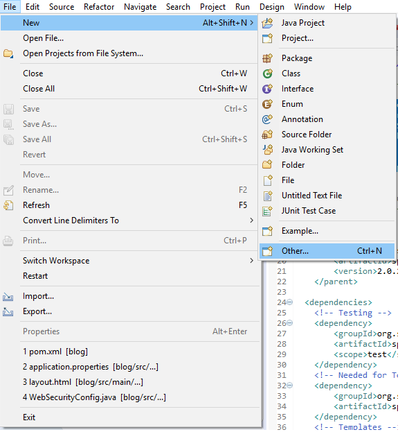
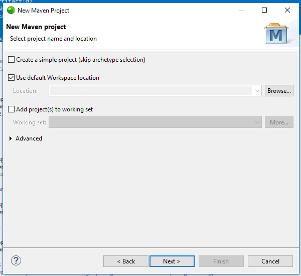
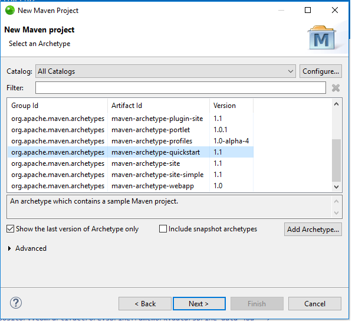
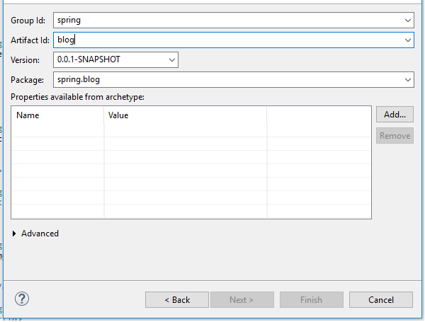

### Installation
Once the project has been created, clone this repository to your local environment and let Maven works its magic.

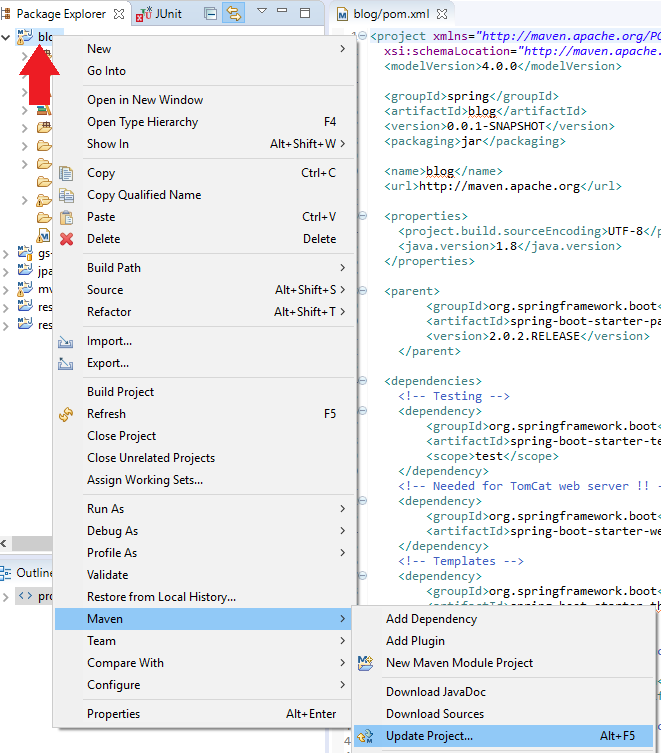

### Create application.properties file under src/main/resources folder with the following settings:

```
# ==============================================================
# src/main/resources/application.properties
# ==============================================================
# = Server port to use
# ==============================================================
server.port=8090

# ===============================
# = Thymeleaf configurations
# ===============================
spring.thymeleaf.cache=FALSE

# ==============================================================
# = Disable the Whitelabel Error Page 
# ==============================================================
server.error.whitelabel.enabled=FALSE

# ==============================================================
# = DATA SOURCE - MySQL
# ==============================================================
spring.datasource.driver-class-name=com.mysql.cj.jdbc.Driver
spring.datasource.url=jdbc:mysql://localhost:3306/blog_db?characterEncoding=utf8&useSSL=false&serverTimezone=America/Chicago
spring.datasource.username=<YOUR_DB_USERNAME>
spring.datasource.password=<YOUR_DB_USERPASSWORD>

# ==============================================================
# = Spring Security / Queries for AuthenticationManagerBuilder  
# ==============================================================
spring.queries.users-query=select user_name, password_hash, id from users where user_name=?
#spring.queries.roles-query=select u.user_name, r.role from users u inner join user_role ur on(u.user_id=ur.user_id) inner join role r on(ur.role_id=r.role_id) where u.user_name=?
# Don't want to use roles for now so set all as ADMIN
# ==============================================================
# if you want to use hasRole('ADMIN'), use this:
#spring.queries.roles-query=select user_name, 'ROLE_ADMIN' AS 'role' from users where user_name=?
# ==============================================================
# if you want to use hasAuthority('ADMIN'), use this:
spring.queries.roles-query=select user_name, 'ADMIN' AS 'role' from users where user_name=?

# ==============================================================
# = JPA / HIBERNATE
# ==============================================================
# Configure Hibernate DDL mode: create / update
# 	spring.jpa.properties.hibernate.hbm2ddl.auto = create
# 	spring.jpa.properties.hibernate.hbm2ddl.auto = update
#
# Create the Database with hbm2ddl.auto
# Ensure the hbm2ddl is enabled (value "create"). NOTE, this needs to be done once !!!, after creating the initial DB setup change to update 
# This will drop the database at application startup and will re-create the database tables according to the entity classes found in the project.
# ==============================================================
spring.jpa.show-sql=TRUE
spring.jpa.properties.hibernate.hbm2ddl.auto=update
```

### About the database
```
If you want to create the database manually, open the step-1-db-create.sql file located under db-schemas folder and execute it on MySQL.

I'm also including a second .sql file to insert some sample data.
```

## Running the application
Open the Application.java file located under spring.blog folder + right click + Run As + Java Application and wait for all components to be loaded (check the console, it will let know your when Tomcat web server is ready).

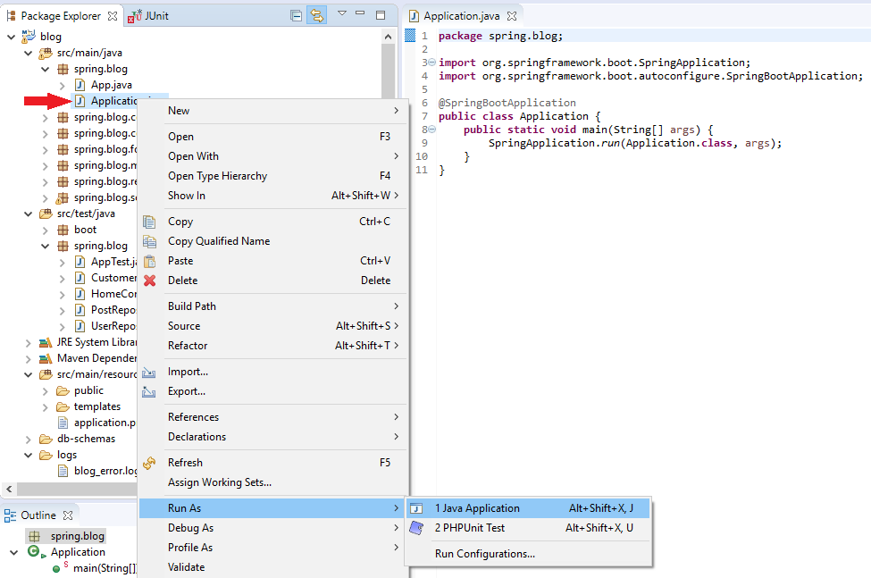
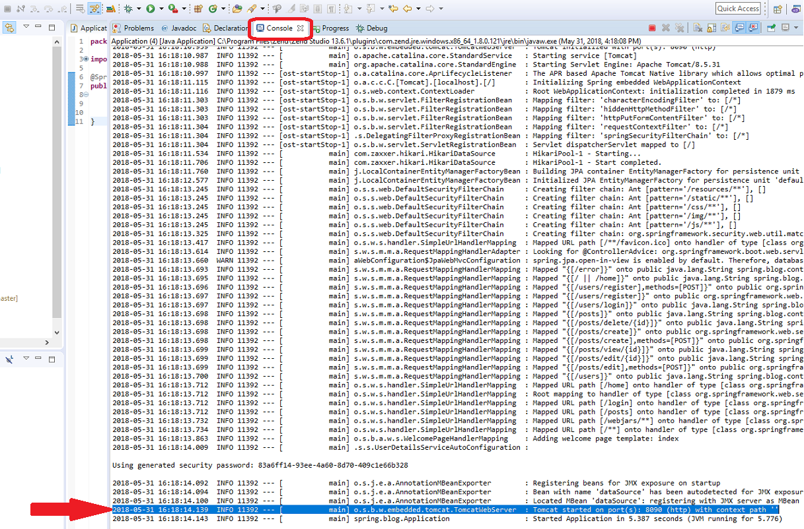

### Exploring the blog

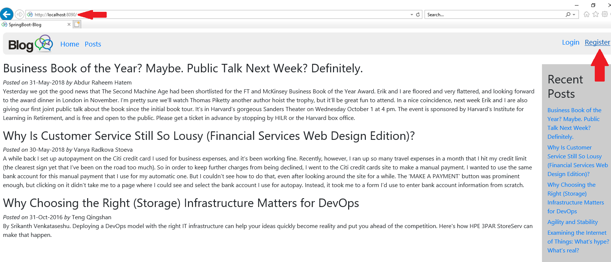
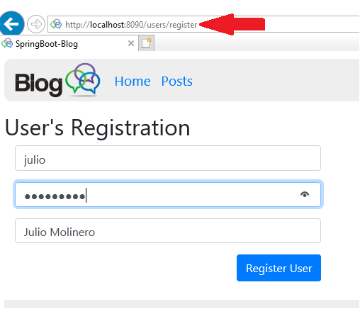
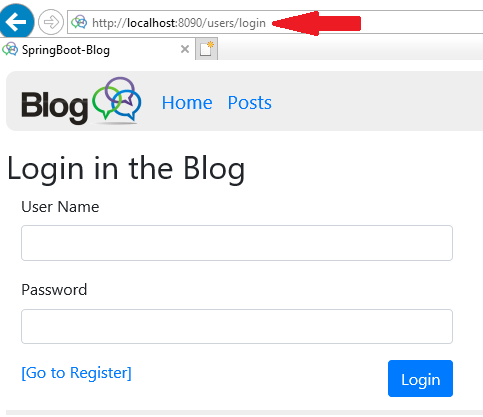
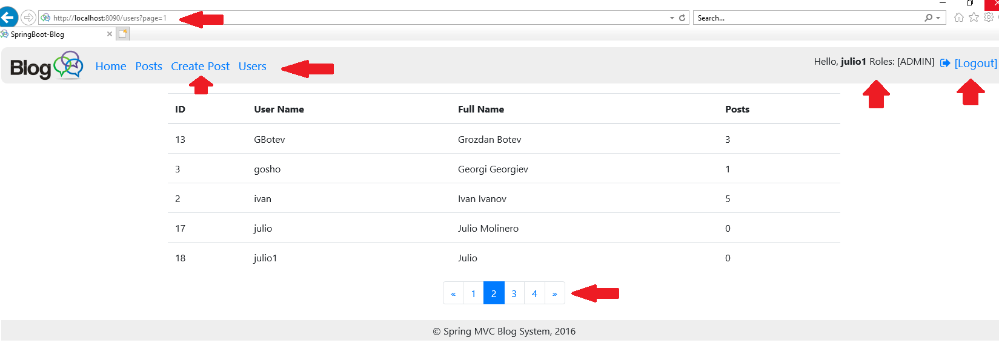

## Testing the application
Expand src/test/java/spring.blog folder and pick any of the files listed. 
The process is pretty much what you did above to run the application but in this case you need to select Run As + JUnit Test, see below.

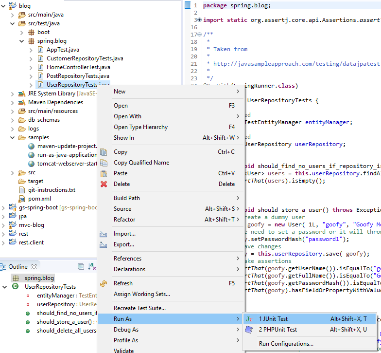
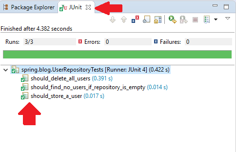

## Acknowledgments

* [Svetlin Nakov](http://www.nakov.com/blog/2016/08/05/creating-a-blog-system-with-spring-mvc-thymeleaf-jpa-and-mysql/)
* [Gustavo Ponce](https://medium.com/@gustavo.ponce.ch/spring-boot-spring-mvc-spring-security-mysql-a5d8545d837d)
* [Pivotal Software](https://spring.io/guides/gs/securing-web/)
* [JavaSampleApproach](http://javasampleapproach.com/testing/datajpatest-with-spring-boot)
* [PurpleBooth](https://gist.github.com/PurpleBooth/109311bb0361f32d87a2) For helping me on the creation of this README file
